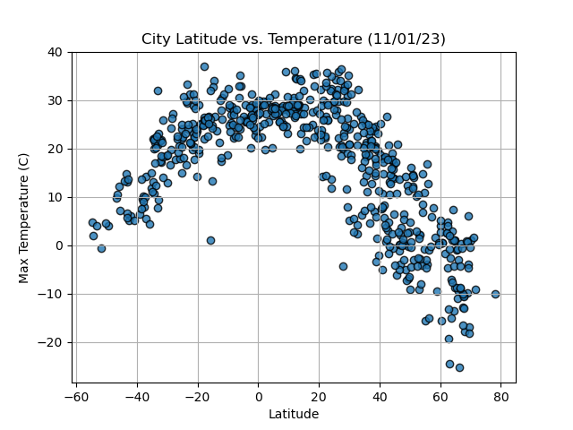
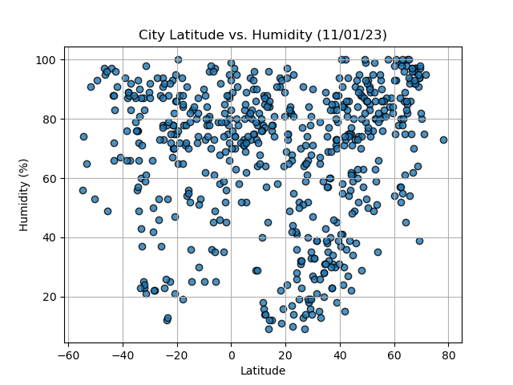
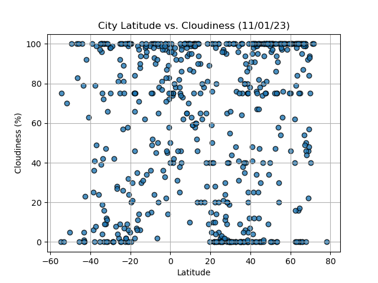
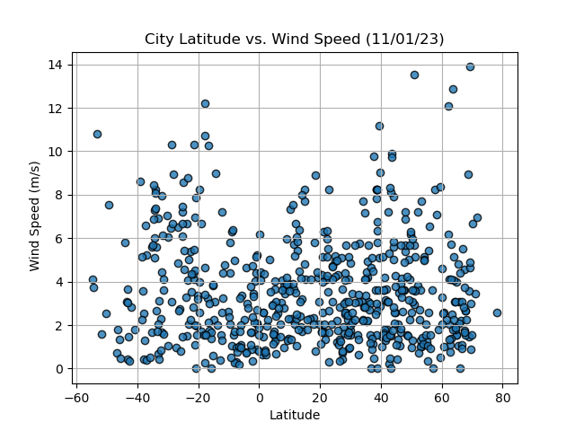

# Python API challenge 
### Part 1: WeatherPy
In this deliverable, you'll create a Python script to visualize the weather of over 500 cities of varying distances from the equator.

**Requirement 1**: Create Plots to Showcase the Relationship Between Weather Variables and Latitude
To fulfill the first requirement, use the OpenWeatherMap API to retrieve weather data from the cities list in *output_data* folder . Next, create a series of scatter plots to showcase the following relationships:

* Latitude vs. Temperature

* Latitude vs. Humidity

* Latitude vs. Cloudiness

* Latitude vs. Wind Speed

**Requirement 2**: Compute Linear Regression for Each Relationship
To fulfill the second requirement, compute the linear regression for each relationship. Separate the plots into Northern Hemisphere (greater than or equal to 0 degrees latitude) and Southern Hemisphere (less than 0 degrees latitude). You may find it helpful to define a function in order to create the linear regression plots.

Next, create a series of scatter plots. Be sure to include the linear regression line, the model's formula, and the r values.

* Northern Hemisphere: Temperature vs. Latitude

* Southern Hemisphere: Temperature vs. Latitude

* Northern Hemisphere: Humidity vs. Latitude

* Southern Hemisphere: Humidity vs. Latitude

* Northern Hemisphere: Cloudiness vs. Latitude

* Southern Hemisphere: Cloudiness vs. Latitude

* Northern Hemisphere: Wind Speed vs. Latitude

* Southern Hemisphere: Wind Speed vs. Latitude

### Part 2: VacationPy
In this deliverable, use your weather data skills to plan future vacations. Also, use Jupyter notebooks, the geoViews Python library, and the Geoapify API.

* Create a map that displays a point for every city in the city_data_df DataFrame. The size of the point should be the humidity in each city.

* Narrow down the city_data_df DataFrame to find your ideal weather condition. For example:

    * A max temperature lower than 27 degrees but higher than 21

    * Wind speed less than 4.5 m/s

    * Zero cloudiness

* Create a new DataFrame called hotel_df to store the city, country, coordinates, and humidity.

* For each city, use the Geoapify API to find the first hotel located within 10,000 meters of your coordinates.

* Add the hotel name and the country as additional information in the hover message for each city on the map 

## How to Install and Run the script

To run this script:
1. Copy the git repo link and clone it to your local repository
2. Ensure *output_data* and *starter_code* directories and jupyter notebook files, *WeatherPy.ipynb* and *VacationPy.ipynb* are present
3. Ensure the *cities.csv* dataset is present in the *output_data* folder
4. Run the scripts using **Jupyter Notebook** from *starter_code* directory and view results
5. Be sure to run both the scripts using *Restart & Run All option* from *Kernel* in *Jupyter Notebook* to get error free results
6. Or, you could alternatively run each block of code individually starting from the very top 
7. In additon, you could change the csv dataset containing the same columns in *output_data* folder and run the code to see the results
8. Please find some images of the results the file would generate for WeatherPy part of the challenge below,

City Latitude vs Temperature

City Latitude vs Humidity

City Latitude vs Cloudiness

City Latitude vs Wind Speed

### Note: 
    The data from openweathermap.org and geoapify.com are realtime and the results when run would pertain to the realtime data fetched from the sources. Hence the results could look different. 

---
## Credits

To write this script, I used the starter code provided and discussed the plots with my TAs.   

They helped me write a small portion of the logic to calculate some plot elements. I also discussed a small syntax error with my peer, who helped me correct it and get the desired result.  

---
## References
https://home.openweathermap.org/api_keys

https://myprojects.geoapify.com/api/LREjG6BSv8Q7yYIp6ypY/keys

https://stackoverflow.com/questions/52638844/modulenotfounderror-no-module-named-citipy-error

https://medium.com/@t.rosen2101/how-to-create-a-gitignore-file-to-hide-your-api-keys-95b3e6692e41

